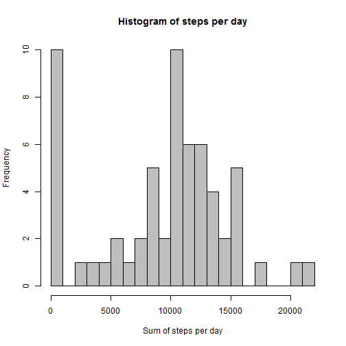
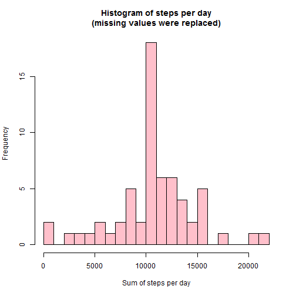

Reproducible Research: Peer Assessment 1

========================================

## Loading and preprocessing the data

First of all we need to load the data into a variable


```r
unzip("activity.zip")
data <- read.csv("activity.csv", stringsAsFactors = FALSE)
data$date <- as.Date(data$date)
```

Our data looks like this:


```r
summary(data)
```

```
##      steps             date               interval     
##  Min.   :  0.00   Min.   :2012-10-01   Min.   :   0.0  
##  1st Qu.:  0.00   1st Qu.:2012-10-16   1st Qu.: 588.8  
##  Median :  0.00   Median :2012-10-31   Median :1177.5  
##  Mean   : 37.38   Mean   :2012-10-31   Mean   :1177.5  
##  3rd Qu.: 12.00   3rd Qu.:2012-11-15   3rd Qu.:1766.2  
##  Max.   :806.00   Max.   :2012-11-30   Max.   :2355.0  
##  NA's   :2304
```

I also want to operate data via dplyr sintax, so I will load dplyr package and 
perform a transformation to dplyr data format.


```r
library(dplyr)
d <- tbl_df(data)
d
```

```
## Source: local data frame [17,568 x 3]
## 
##    steps       date interval
##    (int)     (date)    (int)
## 1     NA 2012-10-01        0
## 2     NA 2012-10-01        5
## 3     NA 2012-10-01       10
## 4     NA 2012-10-01       15
## 5     NA 2012-10-01       20
## 6     NA 2012-10-01       25
## 7     NA 2012-10-01       30
## 8     NA 2012-10-01       35
## 9     NA 2012-10-01       40
## 10    NA 2012-10-01       45
## ..   ...        ...      ...
```

```r
rm(data)
```

## What is mean total number of steps taken per day?

Let's calculate total number of steps taken per day.


```r
steps_per_day <- d %>% group_by(date) %>% summarize(steps_sum = sum(steps, na.rm=TRUE))
```

Let's make a histogram of the total number of steps taken each day


```r
hist(steps_per_day$steps_sum, 
     breaks = 16, 
     main = "Histogram of steps per day", 
     xlab = "Sum of steps per day")
```

 

Calculate and report the mean and median of the total number of steps taken per day.


```r
avg <- mean(steps_per_day$steps_sum)
#9354.23
med <- median(steps_per_day$steps_sum)
#10395
```

Mean is 9354.2295082 and median is 10395.

## What is the average daily activity pattern?

Let's calculate average number of steps taken per each 5-minute time interval and plot it.


```r
steps_avg_interval <- d %>% group_by(interval) %>% summarize(steps_avg = mean(steps, na.rm=TRUE))
plot(steps_avg_interval, 
     type = "l", 
     main = "Daily activity pattern", 
     xlab = "5-minute Interval", 
     ylab = "Average steps taken")
```

 

Then find a 5-minute interval, on average across all the days in the dataset, that contains the maximum number of steps.


```r
max_steps <- max(steps_avg_interval$steps_avg)
max_interval <- as.numeric(steps_avg_interval %>% 
                               filter(steps_avg == max_steps) %>% 
                               select(interval)
                           )
# 206.1698
# 835
```

The maximum average number of steps is 206.1698113 and it was taken in 835 interval.

## Imputing missing values

Lets' calculate the total number of missing values in our dataset.


```r
cnt_na <- sum(is.na(d$steps))
```

Total number of missing (NA) values is 2304 (it also can be seen in first data summary).

I'll fill in all missing values with mean value for corresponding 5-minute interval. 
Remember that these mean values were calculated during previous step.

For these manipulations i'll create a new dataset equal to original dataset so as to make transformation on it.


```r
d2 <- d
merged <- tbl_df(merge(d2, steps_avg_interval, by.x = "interval", by.y = "interval", all.x = TRUE)) %>%
    mutate(steps_new = steps)

indexes <- which(is.na(merged$steps)) 
merged$steps_new[ indexes ] <- merged$steps_avg[ indexes ]
```

Make a histogram of the total number of steps taken each day and 


```r
steps_per_day1 <- merged %>% group_by(date) %>% summarize(steps_sum = sum(steps_new))
hist(steps_per_day1$steps_sum, 
     breaks = 16,
     main = "Histogram of steps per day\n(missing values were replaced)", 
     xlab = "Sum of steps per day")
```

 


```r
avg1 <- mean(steps_per_day1$steps_sum)
# 10766.19
med1 <- median(steps_per_day1$steps_sum)
# 10766.19
```

Mean is 1.0766189 &times; 10<sup>4</sup> and median is 1.0766189 &times; 10<sup>4</sup>.

As we can see new values of mean and median differ from previously calculated estimated values:
- mean: 1.0766189 &times; 10<sup>4</sup> instead of 9354.2295082;
- median: 1.0766189 &times; 10<sup>4</sup> instead of 10395.
The impact of imputing missing data is enlarging values.

## Are there differences in activity patterns between weekdays and weekends?

For data manipulating I'll use wday() function from lubridate package 
(instead of regular weekdays() function).

Create a new factor variable in the dataset with two levels – “weekday” and “weekend” indicating whether a given date is a weekday or weekend day.


```r
library(lubridate)
merged <- merged %>% mutate(wday = wday(date), dtype = "Weekday")
# days 1 and 7 are weekend days
indexes1 <- which(merged$wday %in% c(1,7))
merged$dtype[ indexes1 ] <- "Weekend"
merged %>% mutate(dtype = as.factor(dtype))
```

```
## Source: local data frame [17,568 x 7]
## 
##    interval steps       date steps_avg steps_new  wday   dtype
##       (int) (int)     (date)     (dbl)     (dbl) (dbl)  (fctr)
## 1         0    NA 2012-10-01  1.716981  1.716981     2 Weekday
## 2         0     0 2012-11-23  1.716981  0.000000     6 Weekday
## 3         0     0 2012-10-28  1.716981  0.000000     1 Weekend
## 4         0     0 2012-11-06  1.716981  0.000000     3 Weekday
## 5         0     0 2012-11-24  1.716981  0.000000     7 Weekend
## 6         0     0 2012-11-15  1.716981  0.000000     5 Weekday
## 7         0     0 2012-10-20  1.716981  0.000000     7 Weekend
## 8         0     0 2012-11-16  1.716981  0.000000     6 Weekday
## 9         0     0 2012-11-07  1.716981  0.000000     4 Weekday
## 10        0     0 2012-11-25  1.716981  0.000000     1 Weekend
## ..      ...   ...        ...       ...       ...   ...     ...
```

Let's calculate activity patterns for weekdays and weekends 


```r
steps_avg_dtype <- merged %>% 
    group_by(dtype, interval) %>% 
    summarize(steps_avg = mean(steps_new)) %>%
    print()
```

```
## Source: local data frame [576 x 3]
## Groups: dtype [?]
## 
##      dtype interval  steps_avg
##      (chr)    (int)      (dbl)
## 1  Weekday        0 2.25115304
## 2  Weekday        5 0.44528302
## 3  Weekday       10 0.17316562
## 4  Weekday       15 0.19790356
## 5  Weekday       20 0.09895178
## 6  Weekday       25 1.59035639
## 7  Weekday       30 0.69266247
## 8  Weekday       35 1.13794549
## 9  Weekday       40 0.00000000
## 10 Weekday       45 1.79622642
## ..     ...      ...        ...
```

and then make a panel plot to show differences between them.


```r
library(lattice)
xyplot(steps_avg ~ interval | dtype, 
       data=steps_avg_dtype, 
       layout = c(1,2), 
       type = "l", 
       xlab = "Interval", 
       ylab = "Number of steps", 
       main = "Activity patterns for weekdays and weekends ")
```

 
